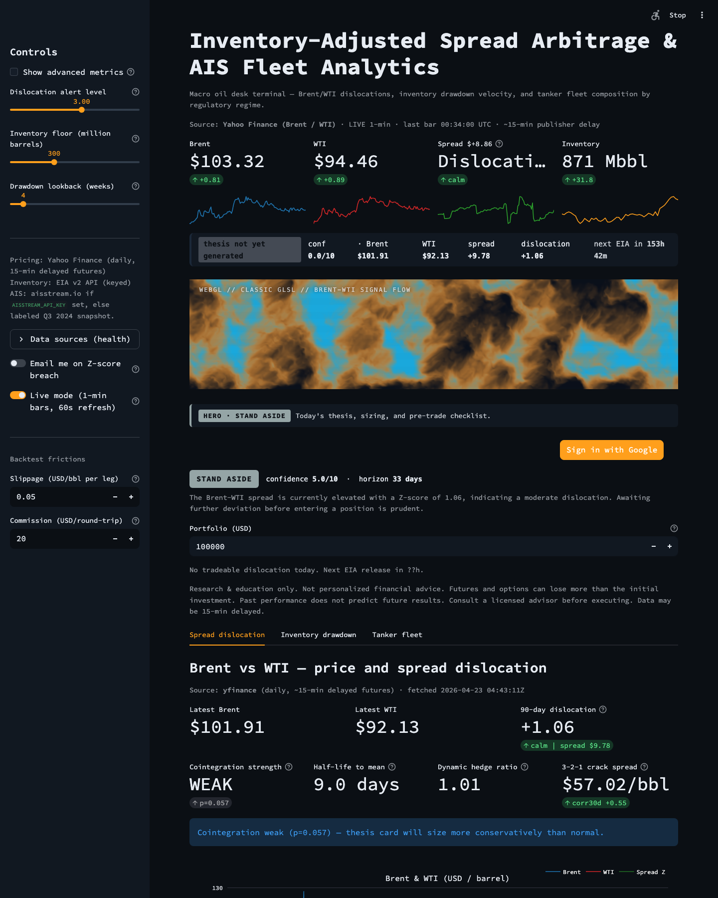
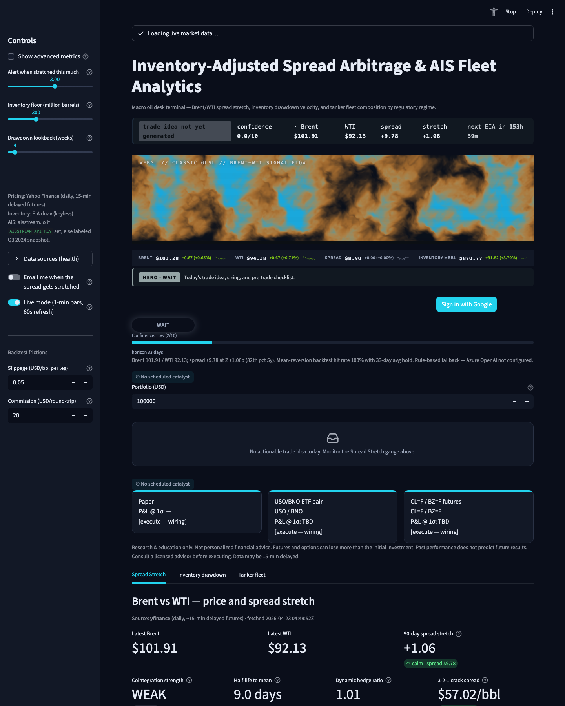

# Inventory-Adjusted Spread Arbitrage & AIS Fleet Analytics Model

A Next.js 15 + FastAPI terminal for an oil desk: Brent/WTI dislocation
z-scores, US inventory drawdown velocity, and mock AIS-based tanker
fleet exposure by regulatory regime, with a WebGPU/Three.js TSL hero
shader, a textured day/night Earth globe, and an Azure OpenAI / Azure
AI Foundry-backed market-commentary panel.

- **Live (React Static Web App):** https://delightful-pebble-00d8eb30f.7.azurestaticapps.net/
- **Live (FastAPI backend):** https://oil-tracker-api-canadaeast-0f18.azurewebsites.net/
- **Repo:** https://github.com/Aidan2111/macro-oil-terminal

[](https://github.com/Aidan2111/macro-oil-terminal/actions/workflows/ci.yml)
[](https://github.com/Aidan2111/macro-oil-terminal/actions/workflows/ci-nextjs.yml)
[](https://github.com/Aidan2111/macro-oil-terminal/actions/workflows/cd-nextjs.yml)

> **Streamlit retired (2026-04-26).** The original Streamlit terminal at
> `oil-tracker-app-canadaeast-4474.azurewebsites.net` was the rollback
> target during the React/FastAPI migration. Once the React stack hit
> 48h of clean uptime, the Streamlit app was scheduled for Azure
> decommission (see `scripts/streamlit-decommission.sh`). This repo now
> ships only the Next.js + FastAPI stack.

## Latest UI (v0.4)

2-up before/after on the hero band:

<p align="center">
  
  
</p>

Full 5-screenshot set: see `docs/screenshots/{before,after}/`.

## Screens


## Quick start

```bash
# Backend — FastAPI on :8000
python3.11 -m venv .venv && source .venv/bin/activate
pip install -r requirements.txt -r backend/requirements.txt
uvicorn backend.main:app --reload --port 8000

# Frontend — Next.js dev server on :3000 (talks to :8000 via NEXT_PUBLIC_API_URL)
cd frontend
npm ci --legacy-peer-deps
NEXT_PUBLIC_API_URL=http://127.0.0.1:8000 npm run dev
```

## Structure

| Path | Purpose |
| --- | --- |
| `frontend/` | Next.js 15 App Router UI — hero band, charts, fleet globe, ticker tape |
| `backend/` | FastAPI service — `/health`, `/api/build-info`, `/api/spread`, `/api/thesis/*`, `/api/positions`, `/api/cftc`, `/api/inventory`, `/api/fleet` |
| `data_ingestion.py` | yfinance pricing (5y), simulated 2y inventory, 500-vessel AIS mock, aisstream.io stub |
| `quantitative_models.py` | Brent-WTI spread Z-score, depletion regression, flag-state categorization, mean-reversion backtest |
| `webgpu_components.py` | Three.js TSL hero shader + day/night Earth globe (WebGL fallback) — kept for legacy reference; React stack uses `frontend/components/globe/` |
| `ai_insights.py` | Azure OpenAI commentary with deterministic canned fallback |
| `trade_thesis.py` | Azure OpenAI / Foundry JSON-schema thesis generator |
| `scripts/streamlit-decommission.sh` | One-shot Azure teardown of the legacy Streamlit web app + plan |
| `DEPLOY.md` | GitHub + Azure command blueprints |

## Tabs

1. **Macro Arbitrage** — Brent vs WTI prices + 90-day rolling Z-score of the
   spread. Horizontal red lines mark the user threshold. Historical
   mean-reversion backtest below (equity curve + trade blotter + CSV).
2. **Depletion Forecast** — Total US inventory (commercial + SPR) with a
   dashed linear-regression projection. Big-metric values for daily
   drawdown rate and projected floor breach date.
3. **Fleet Analytics** — Aggregate Mbbl on water by three categories
   (Jones Act / Domestic, Shadow Risk, Sanctioned), plus an interactive
   Three.js WebGPU Earth globe (day/night via TSL) with instanced tanker
   points colored by category.
4. **AI Insights** — Azure OpenAI / Azure AI Foundry-generated commentary
   synthesising the current Z-score, depletion rate, and fleet mix into a
   short trader note plus three risk bullets. Falls back to a deterministic
   canned narrative if the relevant env vars aren't set.

## Validation

```bash
# Backend + shared module unit tests
python -m pytest tests/unit backend/

# Frontend unit + component tests
cd frontend && npm run lint && npm run typecheck && npm test
```

The yfinance call degrades to a synthetic fallback if the network is
unreachable, so tests remain deterministic offline.

## Contributing

All feature work follows the Superpowers-inspired workflow
(brainstorm -> design -> worktree -> plan -> TDD -> review -> finish).
See [`CONTRIBUTING.md`](CONTRIBUTING.md) and [`docs/workflow.md`](docs/workflow.md).

## Data sources

All four live provider paths are implemented; each is key-gated where a key is required. Priority order + graceful fallback is enforced in `providers/` so the UI never shows fake numbers.

| Domain | Primary | Fallback | Env var | Signup |
| --- | --- | --- | --- | --- |
| Pricing (Brent/WTI) | yfinance (BZ=F, CL=F) | Twelve Data -> Polygon | `TWELVEDATA_API_KEY`, `POLYGON_API_KEY` (both optional) | n/a |
| Inventory | EIA **v2 JSON API** (`api.eia.gov/v2/seriesid/PET.*.W`) | EIA dnav HTML scrape (keyless) -> FRED (keyed) | `EIA_API_KEY`, `FRED_API_KEY` (optional) | `https://www.eia.gov/opendata/register.php` |
| AIS (tanker fleet) | aisstream.io websocket | Labeled Q3 2024 fleet-composition snapshot (never random) | `AISSTREAM_API_KEY` | `https://aisstream.io/apikeys` (GitHub OAuth) |
| Positioning (CFTC COT) | `fut_disagg_txt_YYYY.zip` weekly disaggregated | n/a (no key needed) | — | n/a |

Every provider exposes `health_check()`; the React UI surfaces green / amber / red dots with latency and notes.

### Environment variables

```
AZURE_OPENAI_ENDPOINT       # Trade Thesis / AI Insights
AZURE_OPENAI_KEY
AZURE_OPENAI_DEPLOYMENT     # default / legacy deployment name
AZURE_OPENAI_DEPLOYMENT_FAST  # "Quick read" mode
AZURE_OPENAI_DEPLOYMENT_DEEP  # "Deep analysis" reasoning mode

USE_FOUNDRY                          # opt in to the Azure AI Foundry agent path
AZURE_AI_FOUNDRY_PROJECT_ENDPOINT
AZURE_AI_FOUNDRY_PROJECT_CONNECTION_STRING
AZURE_AI_FOUNDRY_AGENT_MODEL_FAST
AZURE_AI_FOUNDRY_AGENT_MODEL_DEEP

EIA_API_KEY                 # flips inventory to v2 JSON API
FRED_API_KEY                # optional second-fallback
AISSTREAM_API_KEY           # flips Tab 3 to live AIS
TWELVEDATA_API_KEY          # optional pricing fallback
POLYGON_API_KEY             # optional pricing fallback

ALERT_SMTP_*                # optional email alerts on Z-score breach
```

Copy `.env.example` -> `.env` for local dev. On Azure, set via `az webapp config appsettings set`.

## Notes

- When `EIA_API_KEY` is unset, the Depletion view shows an amber "EIA dnav (keyless)" badge; with the key it's green "EIA v2 API (keyed)".
- When `AISSTREAM_API_KEY` is unset, the Fleet view shows a clearly-labeled Q3 2024 crude-tanker flag-composition snapshot (real historical weights, not random numbers). With the key it flips to a green "LIVE AIS — N vessels · last 5 min" badge.
- The CFTC COT positioning chart is keyless; it updates every Friday at 3:30pm ET.
- The WebGPU globe requires a browser that exposes `navigator.gpu`
  (Chrome 113+ / Edge 113+). It falls back to WebGL automatically.
- **Not investment advice.**

## Deployment

**CD is push-to-deploy.** Any push to `main` that touches `backend/**` or
`frontend/**` triggers `.github/workflows/cd-nextjs.yml`, which:

1. installs root + backend Python deps,
2. smoke-imports `backend.main`,
3. logs into Azure via OIDC,
4. zips + ships the FastAPI app to `oil-tracker-api-canadaeast-0f18`,
5. builds Next.js with `NEXT_PUBLIC_API_URL` baked in,
6. uploads the static export to the Azure Static Web App at
   `delightful-pebble-00d8eb30f.7.azurestaticapps.net`.

Required GitHub repository secrets (all OIDC-only, no client secrets):

| Secret | Value |
| --- | --- |
| `AZURE_CLIENT_ID` | App registration `macro-oil-terminal-cd` |
| `AZURE_TENANT_ID` | Youbiquity tenant |
| `AZURE_SUBSCRIPTION_ID` | Target subscription |
| `AZURE_STATIC_WEB_APPS_API_TOKEN` | SWA deploy token |

The service principal has `Contributor` scoped to resource group
`oil-price-tracker`, and federated credentials for:

- `repo:Aidan2111/macro-oil-terminal:ref:refs/heads/main` (push)
- `repo:Aidan2111/macro-oil-terminal:pull_request` (PR checks)
- `repo:Aidan2111/macro-oil-terminal:environment:production` (used by CD)

**Re-trigger manually:**

```bash
gh workflow run cd-nextjs.yml --ref main
gh run watch
```

See `DEPLOY.md` for the original GitHub + Azure command blueprints (used during
bootstrap).
