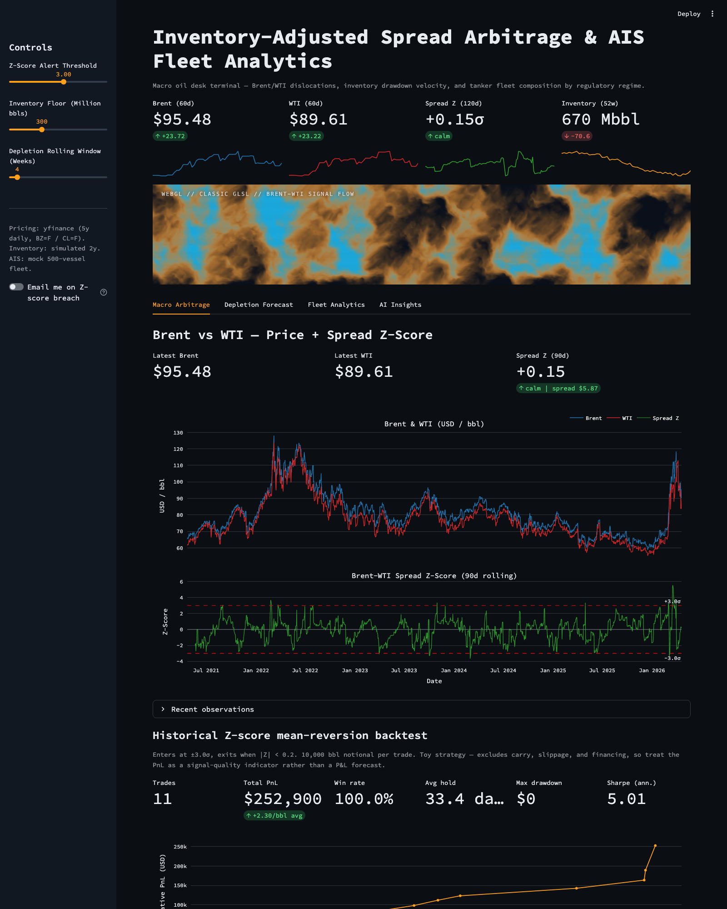
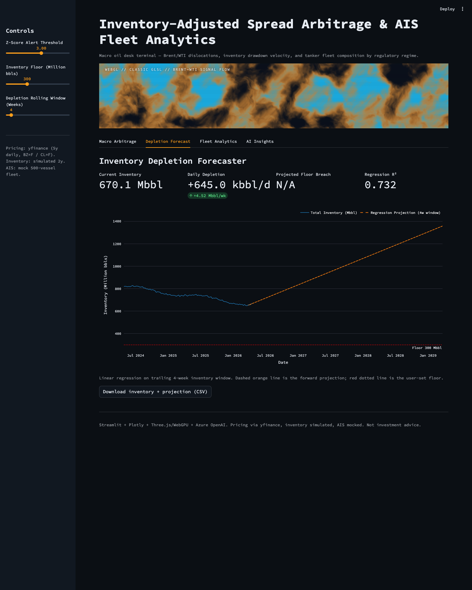
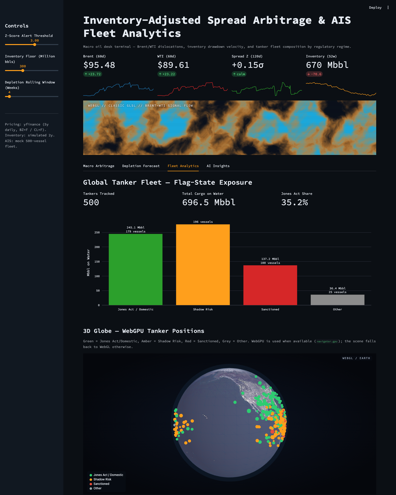
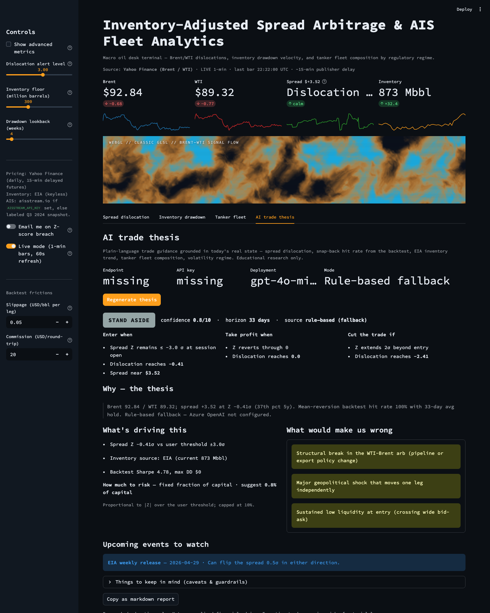

# Inventory-Adjusted Spread Arbitrage & AIS Fleet Analytics Model

A Streamlit terminal for an oil desk: Brent/WTI dislocation z-scores, US
inventory drawdown velocity, and mock AIS-based tanker fleet exposure by
regulatory regime, with a WebGPU/Three.js TSL hero shader, a textured
day/night Earth globe, and an Azure OpenAI-backed market-commentary panel.

- **Live (Azure App Service):** https://oil-tracker-app-canadaeast-4474.azurewebsites.net
- **Repo:** https://github.com/Aidan2111/macro-oil-terminal

[](https://github.com/Aidan2111/macro-oil-terminal/actions/workflows/ci.yml)
[](https://github.com/Aidan2111/macro-oil-terminal/actions/workflows/cd.yml)

## Screens






## Quick start

```bash
pip install -r requirements.txt
streamlit run app.py
```

## Structure

| File | Purpose |
| --- | --- |
| `app.py` | Streamlit UI — 4 tabs, sidebar sliders, Plotly + WebGPU visuals |
| `data_ingestion.py` | yfinance pricing (5y), simulated 2y inventory, 500-vessel AIS mock, aisstream.io stub |
| `quantitative_models.py` | Brent-WTI spread Z-score, depletion regression, flag-state categorization, mean-reversion backtest |
| `webgpu_components.py` | Three.js TSL hero shader + day/night Earth globe (WebGL fallback) |
| `ai_insights.py` | Azure OpenAI commentary with deterministic canned fallback |
| `test_runner.py` | Autonomous validation — 27 checks across all modules |
| `Dockerfile` | Linux + Python 3.11 image, Streamlit entrypoint on :8000 |
| `DEPLOY.md` | GitHub + Azure command blueprints |

## Sidebar controls

- **Z-Score Alert Threshold** (default 3.0σ)
- **Inventory Floor** (default 300 Mbbl)
- **Depletion Rolling Window** (default 4 weeks)

## Tabs

1. **Macro Arbitrage** — Brent vs WTI prices + 90-day rolling Z-score of the
   spread. Horizontal red lines mark the user threshold. Historical
   mean-reversion backtest below (equity curve + trade blotter + CSV).
   All line charts use `plotly.graph_objects.Scattergl` (WebGL).
2. **Depletion Forecast** — Total US inventory (commercial + SPR) with a
   dashed linear-regression projection. Big-metric values for daily
   drawdown rate and projected floor breach date.
3. **Fleet Analytics** — Aggregate Mbbl on water by three categories
   (Jones Act / Domestic, Shadow Risk, Sanctioned), plus an interactive
   Three.js WebGPU Earth globe (day/night via TSL) with instanced tanker
   points colored by category.
4. **AI Insights** — Azure OpenAI-generated commentary synthesising the
   current Z-score, depletion rate, and fleet mix into a short trader
   note plus three risk bullets. Falls back to a deterministic canned
   narrative if `AZURE_OPENAI_ENDPOINT`/`AZURE_OPENAI_KEY` aren't set.

## Validation

```bash
python test_runner.py
```

Covers every public function in `data_ingestion.py` and
`quantitative_models.py`, plus payload-shape tests on the WebGPU helpers.
The yfinance call degrades to a synthetic fallback if the network is
unreachable, so tests remain deterministic offline.

## Contributing

All feature work follows the Superpowers-inspired workflow
(brainstorm → design → worktree → plan → TDD → review → finish).
See [`CONTRIBUTING.md`](CONTRIBUTING.md) and [`docs/workflow.md`](docs/workflow.md).

## Data sources

All four live provider paths are implemented; each is key-gated where a key is required. Priority order + graceful fallback is enforced in `providers/` so the UI never shows fake numbers.

| Domain | Primary | Fallback | Env var | Signup |
| --- | --- | --- | --- | --- |
| Pricing (Brent/WTI) | yfinance (BZ=F, CL=F) | Twelve Data → Polygon | `TWELVEDATA_API_KEY`, `POLYGON_API_KEY` (both optional) | n/a |
| Inventory | EIA **v2 JSON API** (`api.eia.gov/v2/seriesid/PET.*.W`) | EIA dnav HTML scrape (keyless) → FRED (keyed) | `EIA_API_KEY`, `FRED_API_KEY` (optional) | `https://www.eia.gov/opendata/register.php` |
| AIS (tanker fleet) | aisstream.io websocket | Labeled Q3 2024 fleet-composition snapshot (never random) | `AISSTREAM_API_KEY` | `https://aisstream.io/apikeys` (GitHub OAuth) |
| Positioning (CFTC COT) | `fut_disagg_txt_YYYY.zip` weekly disaggregated | n/a (no key needed) | — | n/a |

Every provider exposes `health_check()`; the sidebar "Data sources (health)" expander renders green / amber / red dots with latency and notes.

### Environment variables

```
AZURE_OPENAI_ENDPOINT       # Trade Thesis / AI Insights
AZURE_OPENAI_KEY
AZURE_OPENAI_DEPLOYMENT     # default / legacy deployment name
AZURE_OPENAI_DEPLOYMENT_FAST  # "Quick read" mode
AZURE_OPENAI_DEPLOYMENT_DEEP  # "Deep analysis" reasoning mode

EIA_API_KEY                 # flips inventory to v2 JSON API
FRED_API_KEY                # optional second-fallback
AISSTREAM_API_KEY           # flips Tab 3 to live AIS
TWELVEDATA_API_KEY          # optional pricing fallback
POLYGON_API_KEY             # optional pricing fallback

ALERT_SMTP_*                # optional email alerts on Z-score breach
```

Copy `.env.example` → `.env` for local dev. On Azure, set via `az webapp config appsettings set`.

## Notes

- When `EIA_API_KEY` is unset, the Depletion tab shows an amber "EIA dnav (keyless)" badge; with the key it's green "EIA v2 API (keyed)".
- When `AISSTREAM_API_KEY` is unset, Tab 3 shows a clearly-labeled Q3 2024 crude-tanker flag-composition snapshot (real historical weights, not random numbers). With the key it flips to a green "LIVE AIS — N vessels · last 5 min" badge.
- The CFTC COT positioning chart on tab 1 is keyless; it updates every Friday at 3:30pm ET.
- The WebGPU globe requires a browser that exposes `navigator.gpu`
  (Chrome 113+ / Edge 113+). It falls back to WebGL automatically.
- **Not investment advice.**

## Deployment

**CD is push-to-deploy.** Any push to `main` triggers `.github/workflows/cd.yml`,
which (a) installs requirements, (b) runs `test_runner.py` as a gate, (c) logs
into Azure via OIDC (no long-lived secrets in the repo), (d) zips the app, and
(e) deploys to `oil-tracker-app-canadaeast-4474`. A post-deploy health check retries
`/_stcore/health` up to 10 times. Concurrency group `deploy-prod` serialises
runs so deploys can't overlap.

Required GitHub repository secrets (all OIDC-only, no client secrets):

| Secret | Value |
| --- | --- |
| `AZURE_CLIENT_ID` | App registration `macro-oil-terminal-cd` |
| `AZURE_TENANT_ID` | Youbiquity tenant |
| `AZURE_SUBSCRIPTION_ID` | Target subscription |

The service principal has `Contributor` scoped to resource group
`oil-price-tracker`, and federated credentials for:

- `repo:Aidan2111/macro-oil-terminal:ref:refs/heads/main` (push)
- `repo:Aidan2111/macro-oil-terminal:pull_request` (PR checks)
- `repo:Aidan2111/macro-oil-terminal:environment:production` (used by CD)

**Re-trigger manually:**

```bash
gh workflow run cd.yml --ref main
gh run watch
```

See `DEPLOY.md` for the original GitHub + Azure command blueprints (used during
bootstrap).
