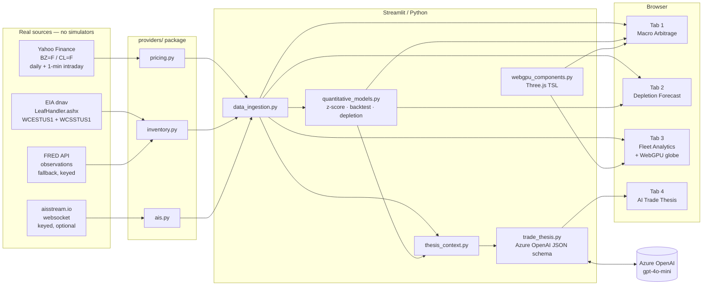
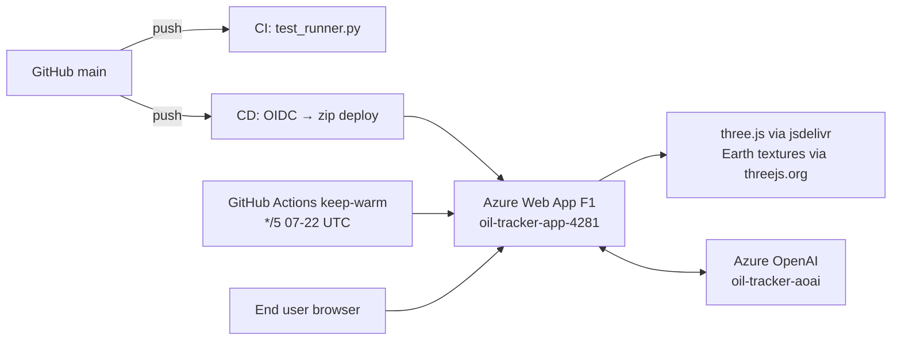

# Architecture

## Data flow

## Deployment surface

## Security posture

* OIDC federated credentials for CD — **no Azure client secret in repo**.
* Azure OpenAI endpoint + key set as App Service App Settings, never in the source tree.
* Secret scanning via pre-commit `gitleaks` (opt-in local hook) and CodeQL (default Python queries, weekly cron + on every push).
* Dependabot watches pip + github-actions + docker, weekly PRs with `deps(*)` prefix.

## Notable trade-offs

* **F1 App Service** — 20s cold start, no always-on. Mitigated by a 5-min keep-warm ping during waking hours. Upgrade to B1 removes the quota block on always-on.
* **No real-time live AIS** without `AISSTREAM_API_KEY` — the UI surfaces a clearly labelled Q3 2024 historical fleet snapshot plus a one-click signup CTA. Key distribution is real; individual vessel names are placeholders.
* **yfinance 1-min intraday** has ~15-min publisher delay for futures — that's the free-tier ceiling. Twelve Data is wired as an upgrade behind `TWELVEDATA_API_KEY`.
* **WebGPU fallback** — Three.js `three/webgpu` with TSL material graphs, falling through to `three.module.js` + WebGL when `navigator.gpu` is unavailable. Earth textures served from `threejs.org/examples` (CC-licensed); if the texture CDN is unreachable we render the procedural navy fallback.
